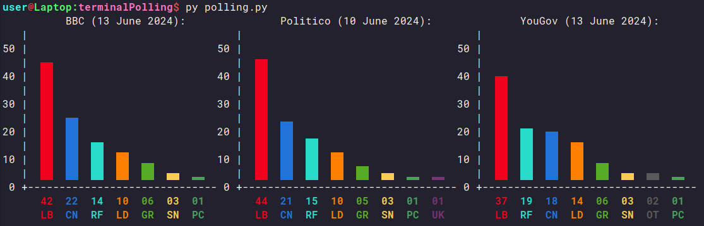

# UK Election 2024 Terminal Polls

A simple Python script to display current average UK election polling in the terminal.

Pulls poll data from the [BBC Election Tracker](https://www.bbc.co.uk/news/uk-politics-68079726), the [Politico Poll of Polls](https://www.politico.eu/europe-poll-of-polls/united-kingdom/) and [YouGov](https://yougov.co.uk/topics/politics/trackers/voting-intention).

Also pulls the estimated seat and vote count from [Electoral Calculus](https://www.electoralcalculus.co.uk/prediction_main.html).

## Requirements

Python and BeautifulSoup4 are the only requirements

BeautifulSoup4 can be installed with pip using this command:  
`pip install beautifulsoup4`

On Arch Linux it can be installed with pacman:  
`pacman -s python-beautifulsoup4`

## Usage

`python3 polling.py` will display the polling data in the terminal  
`python3 polling.py -s` will display the current Electoral Calculus election prediction

## Notes

* The colours used for each party are not the [exact party colours](https://en.wikipedia.org/wiki/Wikipedia:Index_of_United_Kingdom_political_parties_meta_attributes), I used the ones from Politico instead as they are easier to read.
* ~~UKIP is only present in the Politico graph as the BBC doesn't have polling data for them~~ Politico seem to have stopped tracking UKIP polling
* The BBC graph will probably stop working once the election is over, I'll most likely just remove it then as I don't think the BBC have that data outside of election time.

## Register to Vote

Make sure you are [registered to vote](https://www.gov.uk/register-to-vote) before the deadline on the 18th June
